<h1 style="text-align: center;">Wake Word Detector</h1>
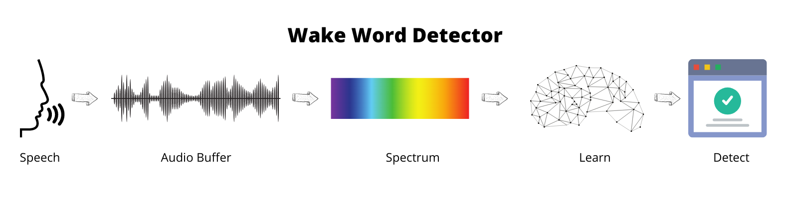

# Table of Contents
- [Background](#background)
- [Introduction](#introduction)
- [Related Work](#related-work)
- [Implementation](#implementation)
    - [Preparing labelled dataset](#preparing-labelled-dataset)
    - [Word Alignment](#word-alignment)
    - [Fix data imbalance](#fix-data-imbalance)
    - [Extract audio features](#extract-audio-features)
    - [Audio transformations](#audio-transformations)
    - [Define model architecture](#define-model-architecture)
    - [Train model](#train-model)
    - [Test Model](#test-model)
    - [Inference](#inference)
        - [Using Pyaudio](#using-pyaudio)
        - [Using web sockets](#using-web-sockets)
        - [Using onnx](#using-onnx)
        - [Using tensorflowjs](#using-tensorflowjs)
        - [Using tflite](#using-tflite)
- [Demo](#demo)
- [Slides](#slides)
- [Conclusion](#conclusion)
- [Enhancements](#enhancements)

# Background
Personal Assistant devices like Google Home, Alexa and Apple Homepod, will be constantly listening for specific set of wake words like “Ok, Google” or “Alexa” or “Hey Siri”, and once these sequence of words are detected it would prompt to user for next commands and respond to them appropriately.

# Introduction
To create a open-source custom wake word detector, which will take audio as input and once the sequence of words are detected then prompt to the user. <br>

Goal is to provide configurable custom detector so that anyone can use it on their own application to perform operations, once configured wake words are detected.

# Related Work
- Firefox Voice 
    - Model was trained using Mozilla Common Voice dataset, used Pytorch (refer paper [Howl](https://arxiv.org/abs/2008.09606)) library to extract audio features and to train model on res8. Custom logic MeydaMelSpectrogram was used to train the model. 
    - Used [Meyda: an audio feature extraction library for the Web
Audio API](http://doc.gold.ac.uk/~mu202hr/publications/RawlinsonSegalFiala_WAC2015.pdf) for audio feature extraction at client side. Mel-frequency cepstral coefficients (MFCCs) is extracted from audio stream. 
    - Used [Honkling](https://aclanthology.org/D19-3016/) (Purely written in Javascript) to do inference on model created using TensorFlow.js and copied above Pytorch model weights to the model created in tensorflow js. 
- This project
    - Model was trained using MCV dataset and generated data using Google Speech to Text. Used Pytorch library to extract audio features and to train model on 2  layer CNN. Used Log MelSpectrogram to train the model. 
    - Server side inference - Used websockets to stream audio from browser to backend and did inference on that model.
    - Client side inference 
        - Used [magenta-js](https://github.com/magenta/magenta-js/blob/master/music/src/core/audio_utils.ts) for audio feature extraction, Log MelSpectrograms are extracted from audio stream. 
        - Converted Pytorch Model to [Open Neural Network Exchange (ONNX)](https://onnx.ai/) model, used [microsoft/onnxjs](https://github.com/microsoft/onnxjs) to do inference on onnx model at client side. 
        - Converted ONNX model to tensorflow model, used [tensorflow js](https://github.com/tensorflow/tfjs) to do inference on tensorflow model
        - Converted tensorflow model to tflite model, used [tflite js](https://github.com/tensorflow/tfjs/tree/master/tfjs-tflite) to do inference on tensorflow lite model. 
# Implementation

## Preparing labelled dataset
Used [Mozilla Common Voice dataset](https://commonvoice.mozilla.org/en/datasets), 
- Go through each wake word and check transcripts for match
- If found then it will be in positive dataset
- If not found then it will be in negative dataset
- Load appropriate mp3 files and trim the silence parts
- save as .wav file and transcript as .lab file
- Code reference [fetch_dataset_mcv.py](train/fetch_dataset_mcv.py)
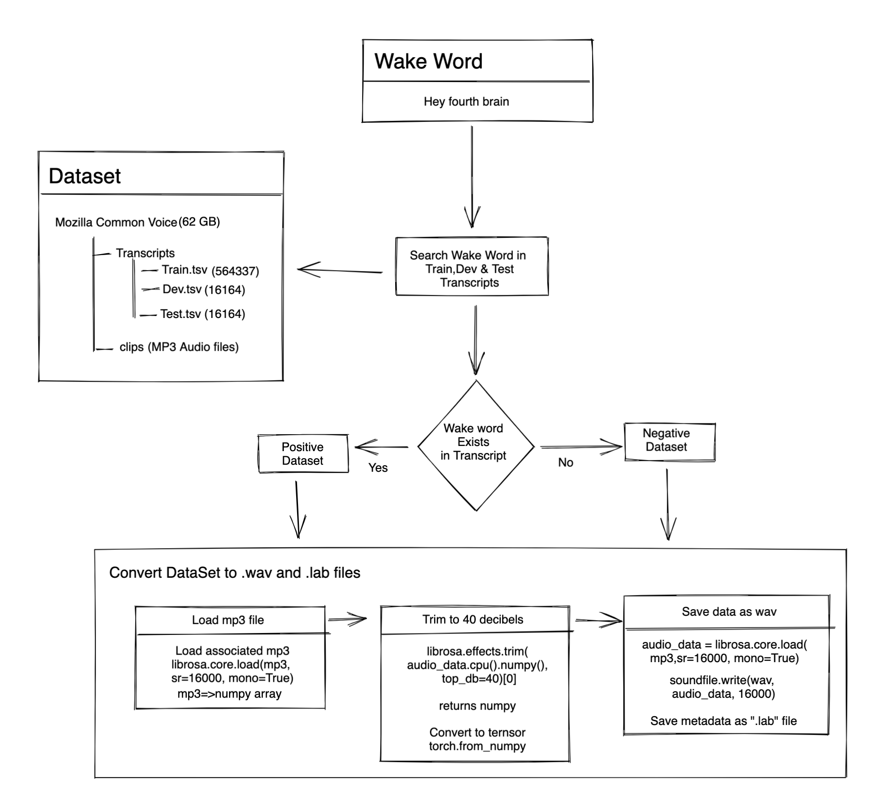

## Word Alignment
- For positive dataset, used [Montreal Forced Alignment](https://github.com/MontrealCorpusTools/Montreal-Forced-Aligner) to get timestamps of each word in audio.
- Download the [stable version](https://github.com/MontrealCorpusTools/Montreal-Forced-Aligner/releases)
    ```bash
    wget https://github.com/MontrealCorpusTools/Montreal-Forced-Aligner/releases/download/v1.0.1/montreal-forced-aligner_linux.tar.gz
    tar -xf montreal-forced-aligner_linux.tar.gz
    rm montreal-forced-aligner_linux.tar.gz
    ```
- Download the [Librispeech Lexicon dictionary](https://www.openslr.org/resources/11/librispeech-lexicon.txt)
    ```bash
    wget https://www.openslr.org/resources/11/librispeech-lexicon.txt
    ```
- Known issues in MFA
    ```bash
    # known mfa issue https://github.com/MontrealCorpusTools/Montreal-Forced-Aligner/issues/109
    cp montreal-forced-aligner/lib/libpython3.6m.so.1.0 montreal-forced-aligner/lib/libpython3.6m.so
    cd montreal-forced-aligner/lib/thirdparty/bin && rm libopenblas.so.0 && ln -s ../../libopenblasp-r0-8dca6697.3.0.dev.so libopenblas.so.0
    ```
- Creating aligned data
    ```bash
    montreal-forced-aligner\bin\mfa_align -q positive\audio librispeech-lexicon.txt montreal-forced-aligner\pretrained_models\english.zip aligned_data
    ```

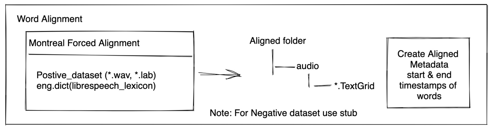
Generated textgrid file 
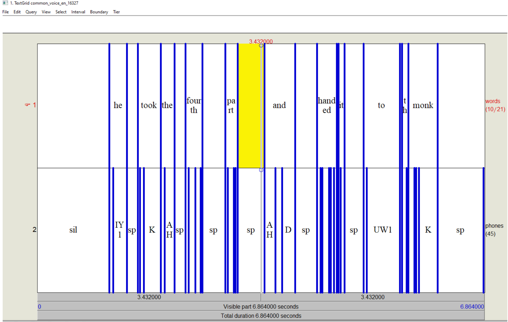

## Fix data imbalance
Check for any data imbalance, if the dataset does not have enough samples containing wake words, consider using text to speech services to generate more samples. 
- Used Google Text To Speech Api, set environment variable `GOOGLE_APPLICATION_CREDENTIALS` with your key.
- Used various speed rates, pitches and voices to generate data for wake words. 
- Code [generate_dataset_google_tts.py](/train/generate_dataset_google_tts.py)

## Extract audio features
- Below is how sound looks like when plotted on time (x-axis) and amplitude (y-axis)
    ```python
    import librosa
    sounddata = librosa.core.load("hey.wav", sr=16000, mono=True)[0]

    # plotting the signal in time series
    plt.plot(sounddata)
    plt.title('Signal')
    plt.xlabel('Time (samples)')
    plt.ylabel('Amplitude')
    ```
    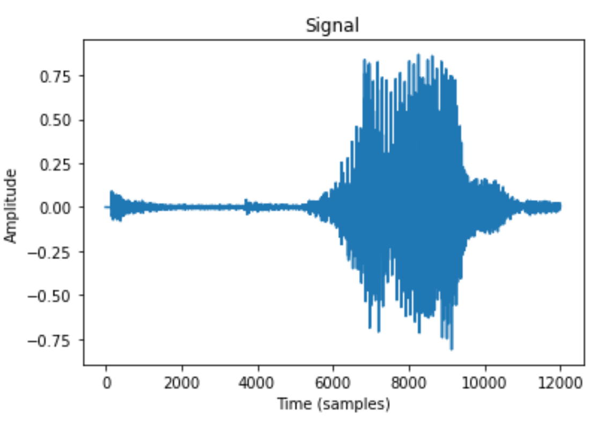
- When Short-time Fourier transform (STFT) computed, below is how spectrogram looks like
    ```python
    from torchaudio.transforms import Spectrogram
    spectrogram  = Spectrogram(n_fft=512,hop_length=200)
    spectrogram.to(device)

    inp = torch.from_numpy(sounddata).float().to(device)
    hey_spectrogram = spectrogram(inp.float())
    plot_spectrogram(hey_spectrogram.cpu(), title="Spectrogram")
    ```
    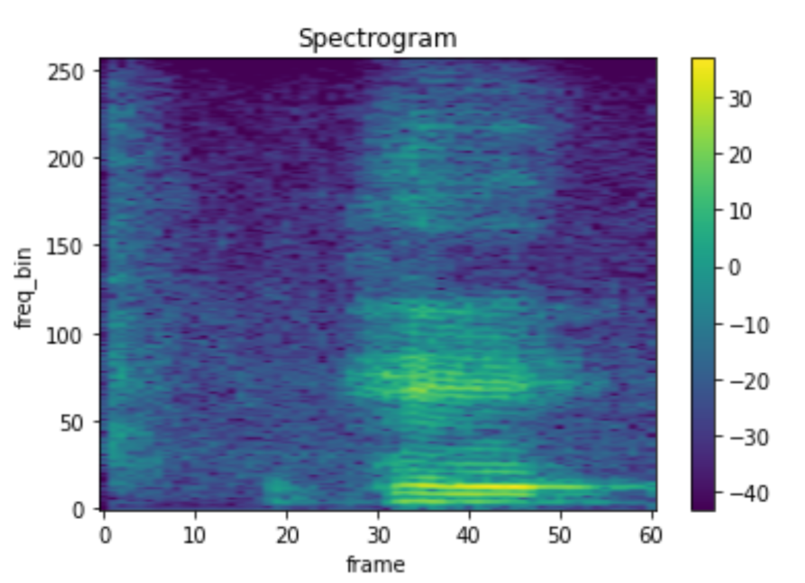
- A mel spectrogram is a spectrogram where the frequencies are converted to the mel scale.
    ```python
    from torchaudio.transforms import MelSpectrogram
    mel_spectrogram  = MelSpectrogram(n_mels=40,sample_rate=16000,
                                    n_fft=512,hop_length=200,
                                    norm="slaney")

    mel_spectrogram.to(device)
    inp = torch.from_numpy(sounddata).float().to(device)
    hey_mels_slaney = mel_spectrogram(inp.float())
    plot_spectrogram(hey_mels_slaney.cpu(), title="MelSpectrogram", ylabel='mel freq')
    ```
    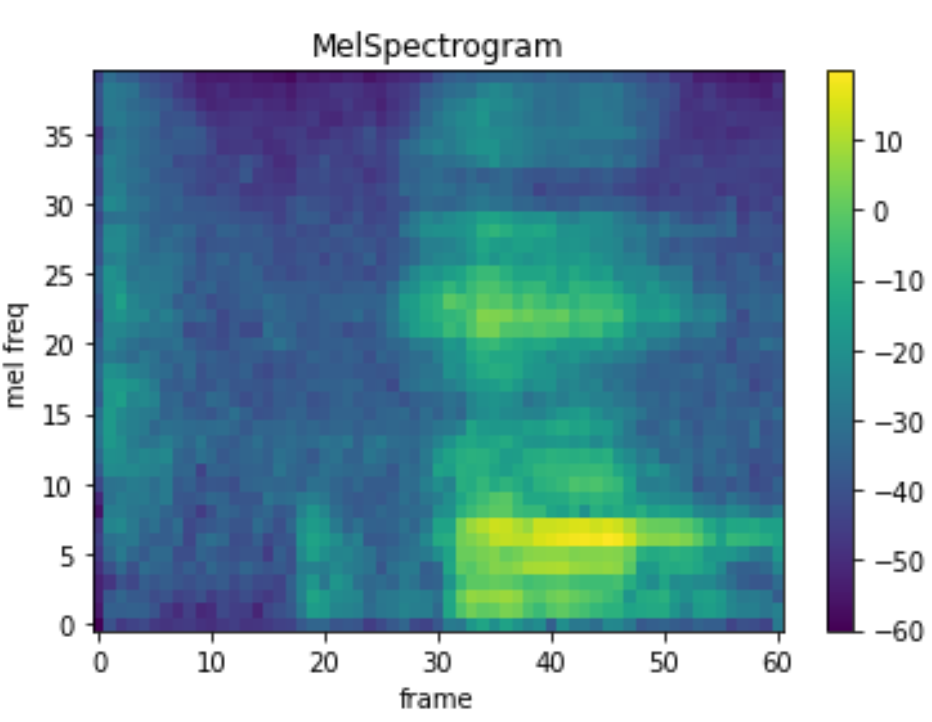
- After adding offset and taking log on mels, below is how final mel spectrogram looks like
    ```python
    log_offset = 1e-7
    log_hey_mel_specgram = torch.log(hey_mels_slaney + log_offset)
    plot_spectrogram(log_hey_mel_specgram.cpu(), title="MelSpectrogram (Log)", ylabel='mel freq')
    ```
    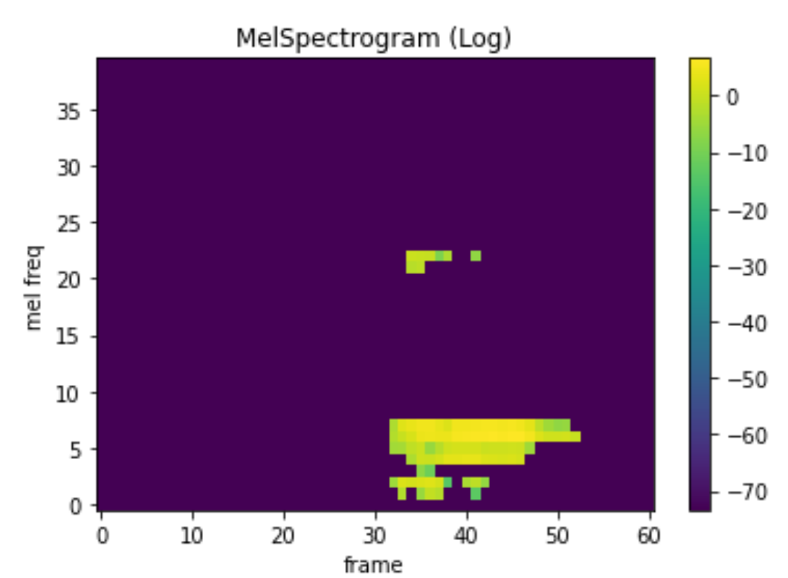

## Audio transformations
- Used [MelSpectrogram](https://pytorch.org/audio/stable/transforms.html#melspectrogram) from Pytorch audio to generate mel spectrogram
    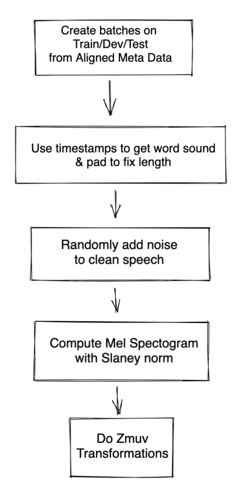
- Hyperparameters
    ```
    Sample rate = 16000 (16kHz)
    Max window length = 750 ms (12000)
    Number of mel bins = 40
    Hop length = 200
    Mel Spectrogram matrix size = 40 x 61
    ```
- Used Zero Mean Unit Variance to scale the values
- Code [transformers.py](train/transformers.py) and [audio_collator.py](train/audio_collator.py) <br>

## Define model architecture
- Given above transformations, Mel spectrogram of size `40x61` will be fed to model
- Below is the CNN model used <br>
    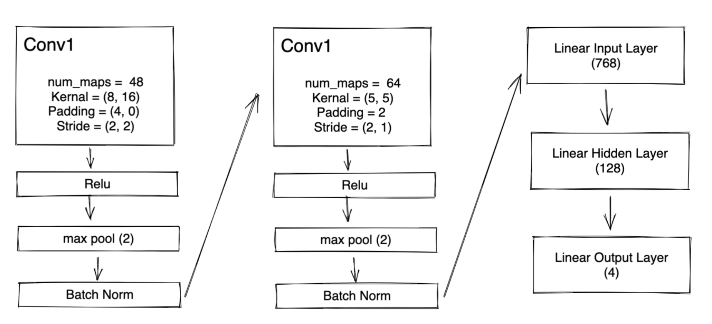
- Code [model.py](train/model.py)
- Below is the CNN model summary <br>
    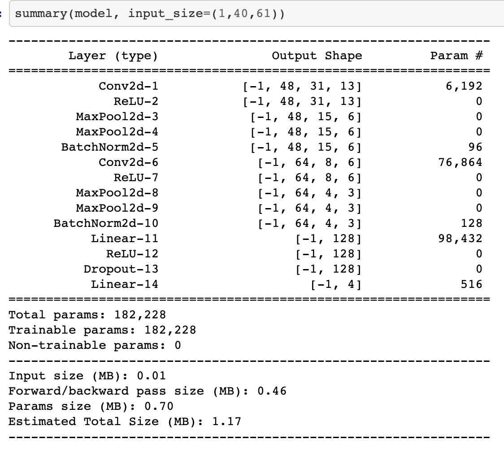

## Train model
- Used batch size as 16, Tensor of size `[16, 1, 40, 61]` will be fed to Model 
    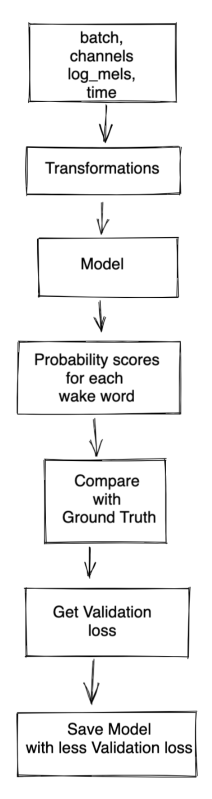
- Used 20 epochs, below is how the train vs validation loss looks like without noise <br>
    
- As you can see, without noise, there is overfitting problem
- Its resolved after adding noise, below is how the train vs validation loss looks like <br>
    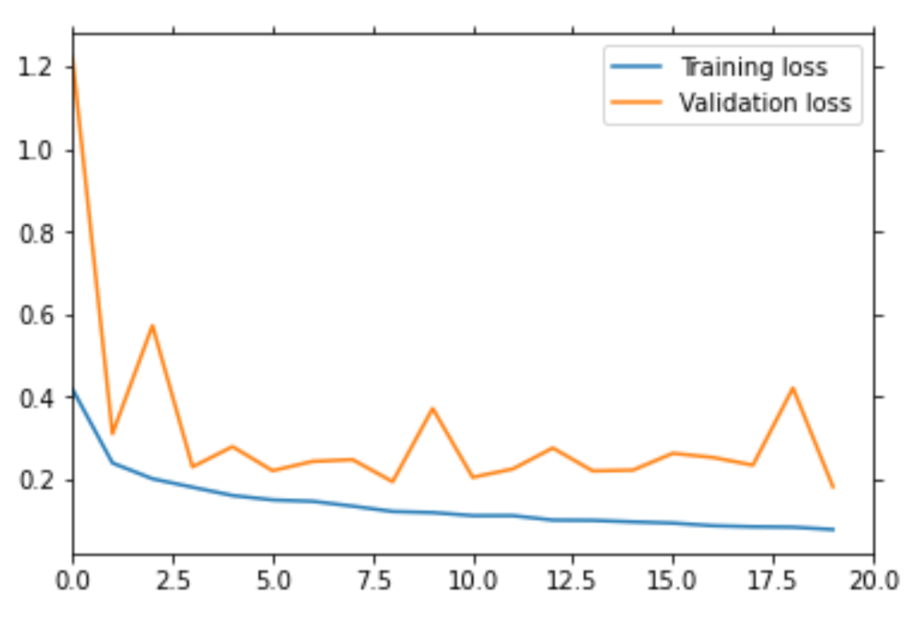
- Code - [train.py](train/train.py) <br>

## Test Model
- Below is how model performed on test dataset, model acheived 87% accuracy <br>
    
- Below is the confusion matrix <br>
    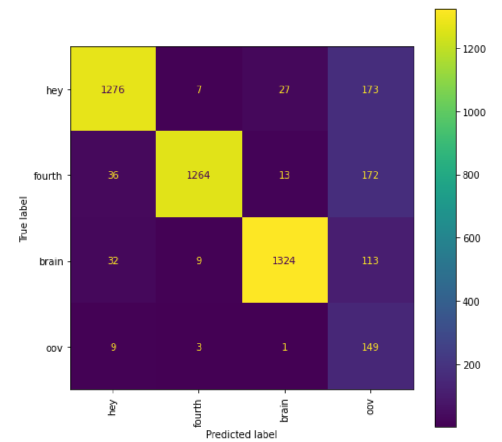
- Below is the ROC curve <br>
    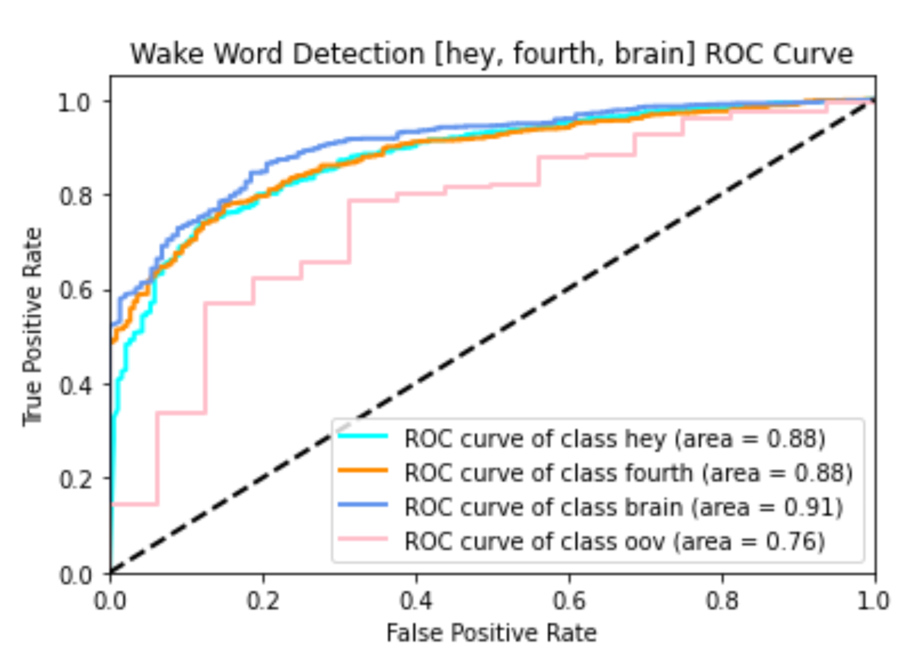
## Inference
Below are the methods used on live streaming audio on above model. 
### Using Pyaudio
- Used [Pyaudio](https://pypi.org/project/PyAudio/), to get input from microphone
- Capture 750ms window of audio buffer 
- After n batches, do transformations and infer on model
- Code - [infer.py](train/infer.py) <br>
- 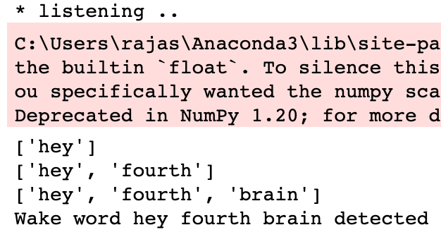
### Using web sockets
- Used [Flask Socketio](https://flask-socketio.readthedocs.io/en/latest/) at server level to capture audio buffer from client. 
- At Client, used [socket.io](https://socket.io/docs/v4/client-installation/) at client level to send audio buffer through socket connection.
- Capture audio buffer using [getUserMedia](https://developer.mozilla.org/en-US/docs/Web/API/Navigator/getUserMedia), convert to array buffer and stream to server.
- Inference will happen at server, after n batches of 750ms window
- If sequence detected, send detected prompt to client. <br>
    
- Server Code - [application.py](server/application.py)
- Client Code - [main.js](server/static/audio/main.js)
- To run this locally 
    ```bash
    cd server
    python -m venv .venv
    pip install -r requirements.txt
    FLASK_ENV=development FLASK_APP=application.py .venv/bin/flask run --port 8011
    ```
    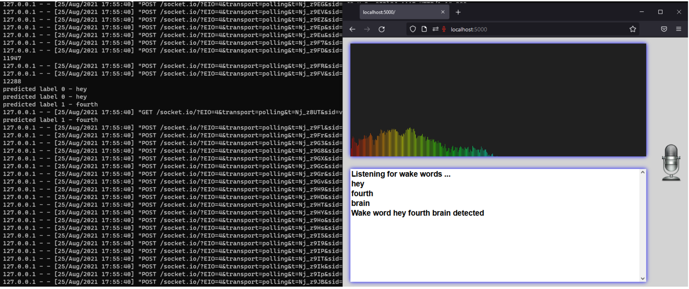
- Use [Dockerfile](server/Dockerfile) & [Dockerrun.aws.json](server/Dockerrun.aws.json) to containerize the app and deploy to [AWS Elastic BeanStalk](https://aws.amazon.com/elasticbeanstalk/)
- Elastic Beanstalk initialize app
    ```bash
    eb init -p docker-19.03.13-ce wakebot-app --region us-west-2
    ```
- Create Elastic Beanstalk instance
    ```bash
    eb create wakebot-app --instance_type t2.large --max-instances 1
    ```
- Disadvantage of above method might be of privacy, since we are sending the audio buffer to server for inference
### Using ONNX
- Used [Pytorch onnx](https://pytorch.org/docs/stable/onnx.html) to convert pytorch model to onnx model
- Pytorch to onnx convert code - [convert_to_onnx.py](server/utils/convert_to_onnx.py)
- Once converted, onnx model can be used at client side to do inference
- Client side, used [onnx.js](https://github.com/microsoft/onnxjs) to do inference at client level
- Capture audio buffer at client using [getUserMedia](https://developer.mozilla.org/en-US/docs/Web/API/Navigator/getUserMedia), convert to array buffer
- Used [fft.js](https://github.com/indutny/fft.js/blob/master/dist/fft.js) to compute [Fourier Transform](https://en.wikipedia.org/wiki/Fourier_transform)
- Used methods from [Meganta.js audio utils](https://github.com/magenta/magenta-js/blob/master/music/src/core/audio_utils.ts) to compute audio transformations like Mel spectrograms
    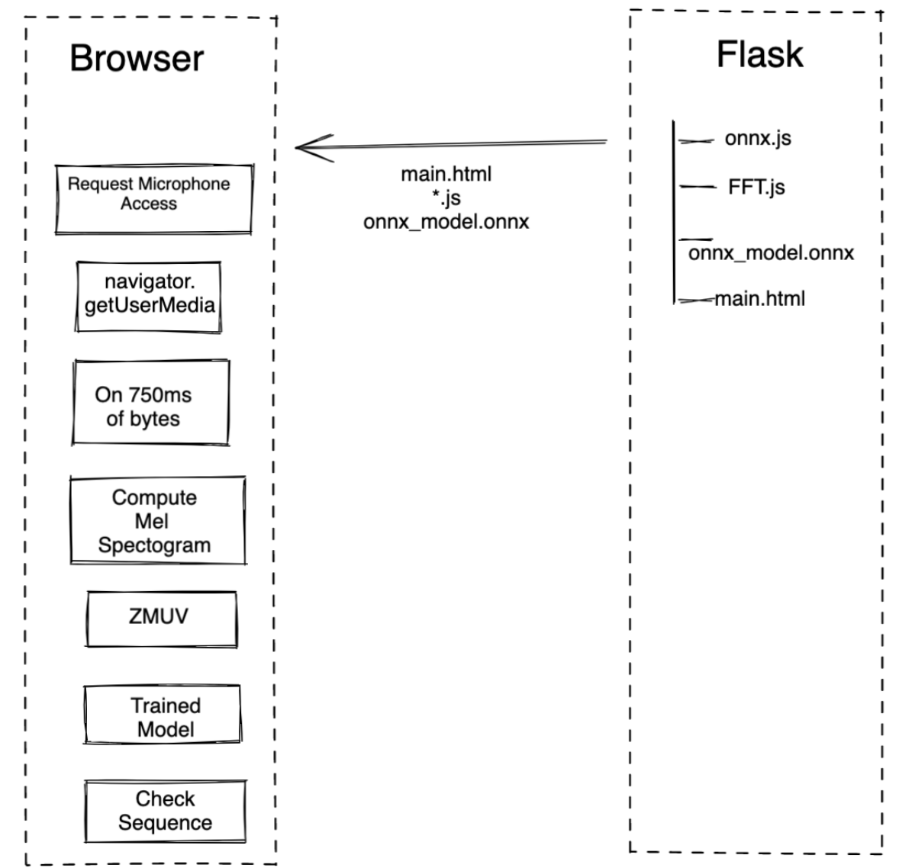
- Below is the comparision of client side vs server side audio transformations <br>
    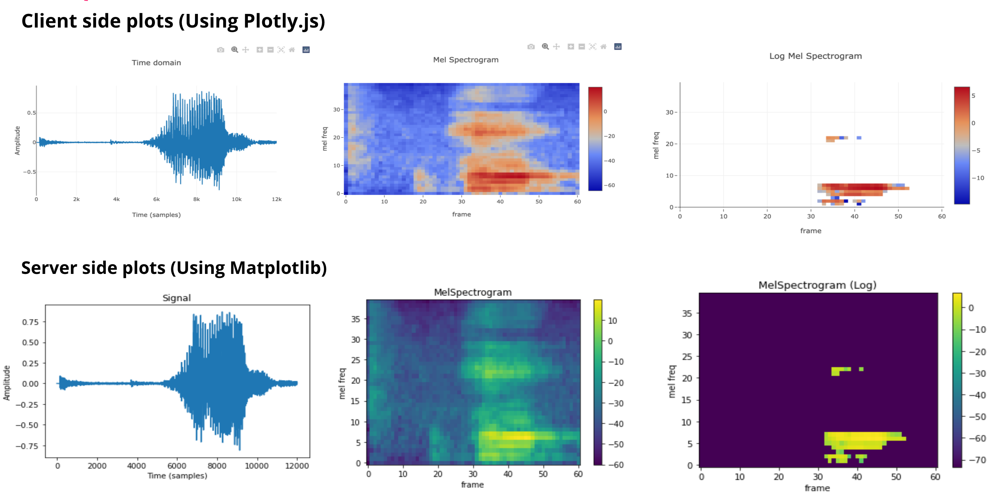
- Client side code - [main.js](standalone/static/audio/main.js)
- To run locally 
    ```bash
    cd standalone
    python -m venv .venv
    pip install -r requirements.txt
    FLASK_ENV=development FLASK_APP=application.py .venv/bin/flask run --port 8011
    ```
    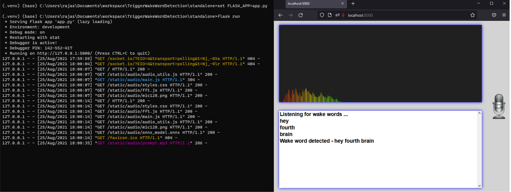
- To deploy to AWS Elastic Beanstalk, first initialize app
    ```bash
    eb init -p python-3.7 wakebot-std-app --region us-west-2
    ```
- Create Elastic Beanstalk instance
    ```bash
    eb create wakebot-std-app --instance_type t2.large --max-instances 1
    ```
- Refer [standalone_onnx](standalone_onnx) for client version without flask, you can deploy on any static server, you can also deploy to [IPFS](https://ipfs.io/)
- Recent version will show, plots and audio buffer for each wake word which model infered for, click on wake word button to know what buffer was infered for that word. 
    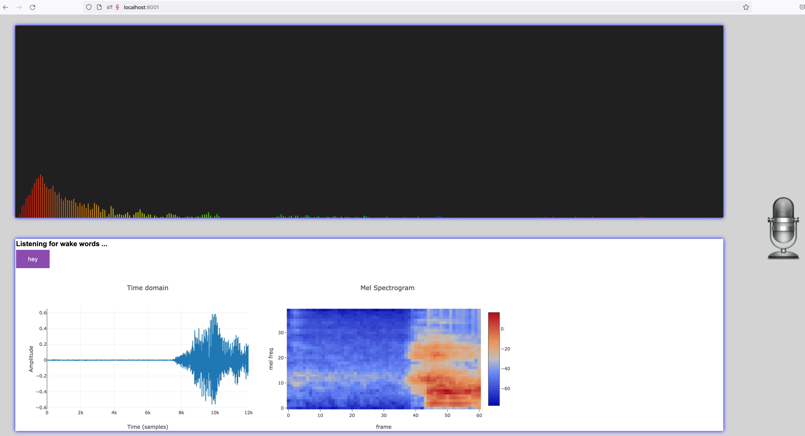
### Using tensorflowjs
- Used [onnx-tensorflow](https://github.com/onnx/onnx-tensorflow) to convert onnx model to tensorflow model
- onnx to tensorflow convert code - [convert_onnx_to_tf.py](onnx_to_tf/convert_onnx_to_tf.py)
    ```
    onnx_model = onnx.load("onnx_model.onnx")  # load onnx model
    tf_rep = prepare(onnx_model)  # prepare tf representation

    # Input nodes to the model
    print("inputs:", tf_rep.inputs)

    # Output nodes from the model
    print("outputs:", tf_rep.outputs)

    # All nodes in the model
    print("tensor_dict:")
    print(tf_rep.tensor_dict)

    tf_rep.export_graph("hey_fourth_brain")  # export the model
    ```
- Verify the model using below command 
    ```
    python .venv/lib/python3.8/site-packages/tensorflow/python/tools/saved_model_cli.py show --dir hey_fourth_brain --all
    ```
    Output
    ```
    MetaGraphDef with tag-set: 'serve' contains the following SignatureDefs:

    signature_def['__saved_model_init_op']:
    The given SavedModel SignatureDef contains the following input(s):
    The given SavedModel SignatureDef contains the following output(s):
        outputs['__saved_model_init_op'] tensor_info:
            dtype: DT_INVALID
            shape: unknown_rank
            name: NoOp
    Method name is: 

    signature_def['serving_default']:
    The given SavedModel SignatureDef contains the following input(s):
        inputs['input'] tensor_info:
            dtype: DT_FLOAT
            shape: (-1, 1, 40, 61)
            name: serving_default_input:0
    The given SavedModel SignatureDef contains the following output(s):
        outputs['output'] tensor_info:
            dtype: DT_FLOAT
            shape: (-1, 4)
            name: PartitionedCall:0
    Method name is: tensorflow/serving/predict

    Defined Functions:
    Function Name: '__call__'
            Named Argument #1
            input

    Function Name: 'gen_tensor_dict'
    ```
- Refer [onnx_to_tf](onnx_to_tf/hey_fourth_brain) for generated files
- Test converted model using [test_tf.py](onnx_to_tf/test_tf.py)
- Used [tensorflowjs[wizard]](https://github.com/tensorflow/tfjs/blob/master/tfjs-converter/README.md) to convert `savedModel` to web model
    ```
    (.venv) (base) ➜  onnx_to_tf git:(main) ✗ tensorflowjs_wizard 
    Welcome to TensorFlow.js Converter.
    ? Please provide the path of model file or the directory that contains model files. 
    If you are converting TFHub module please provide the URL.  hey_fourth_brain
    ? What is your input model format? (auto-detected format is marked with *)  Tensorflow Saved Model *
    ? What is tags for the saved model?  serve
    ? What is signature name of the model?  signature name: serving_default
    ? Do you want to compress the model? (this will decrease the model precision.)  No compression (Higher accuracy)
    ? Please enter shard size (in bytes) of the weight files?  4194304
    ? Do you want to skip op validation? 
    This will allow conversion of unsupported ops, 
    you can implement them as custom ops in tfjs-converter.  No
    ? Do you want to strip debug ops? 
    This will improve model execution performance.  Yes
    ? Do you want to enable Control Flow V2 ops? 
    This will improve branch and loop execution performance.  Yes
    ? Do you want to provide metadata? 
    Provide your own metadata in the form: 
    metadata_key:path/metadata.json 
    Separate multiple metadata by comma.  
    ? Which directory do you want to save the converted model in?  web_model
    converter command generated:
    tensorflowjs_converter --control_flow_v2=True --input_format=tf_saved_model --metadata= --saved_model_tags=serve --signature_name=serving_default --strip_debug_ops=True --weight_shard_size_bytes=4194304 hey_fourth_brain web_model

    ...
    File(s) generated by conversion:
    Filename                           Size(bytes)
    group1-shard1of1.bin                729244
    model.json                          28812
    Total size:                         758056
    ```
- Once above step is done, copy the files to web application
    Example - 
    ```
    ├── index.html
    └── static
        └── audio
            ├── audio_utils.js
            ├── fft.js
            ├── main.js
            ├── mic128.png
            ├── model
            │   ├── group1-shard1of1.bin
            │   └── model.json
            ├── prompt.mp3
            └── styles.css
    ```
- Client side used [tfjs](https://github.com/tensorflow/tfjs) to load model and do inference
- Loading the tensorflow model 
    ```
    let tfModel;
    async function loadModel() {
        tfModel = await tf.loadGraphModel('static/audio/model/model.json');
    }
    loadModel()
    ```
- Do inference using above model
    ```
    let outputTensor = tf.tidy(() => {
    let inputTensor = tf.tensor(dataProcessed, [batch, 1, MEL_SPEC_BINS, dataProcessed.length/(batch * MEL_SPEC_BINS)], 'float32');
    let outputTensor = tfModel.predict(inputTensor);
        return outputTensor
    });
    let outputData = await outputTensor.data();
    ```
### Using tflite
- Once tensorflow model is created, it can be converted to tflite, using below code
    ```
    model = tf.saved_model.load("hey_fourth_brain")
    input_shape = [1, 1, 40, 61]
    func = tf.function(model).get_concrete_function(input=tf.TensorSpec(shape=input_shape, dtype=np.float32, name="input"))
    converter = tf.lite.TFLiteConverter.from_concrete_functions([func])
    tflite_model = converter.convert()
    open("hey_fourth_brain.tflite", "wb").write(tflite_model)
    ```
- Note: `tf.lite.TFLiteConverter.from_saved_model("hey_fourth_brain")` did not work, as it was throwing `conv.cc:349 input->dims->data[3] != filter->dims->data[3] (0 != 1)` on inference, so used above method.
- copy the tflite model to web application
- Used [tflite js](https://github.com/tensorflow/tfjs/tree/master/tfjs-tflite) to load model and do inference
- Loading tflite model 
    ```
    let tfliteModel;
    async function loadModel() {
        tfliteModel = await tflite.loadTFLiteModel('static/audio/hey_fourth_brain.tflite');
    }
    loadModel()
    ```

# Demo
- For live demo 
    - ONNX version -[https://wake-onnx.netlify.app](https://wake-onnx.netlify.app)    
    - Tensorflow js version - [https://wake-tf.netlify.app/](https://wake-tf.netlify.app)
    - Tensorflow lite js version - [https://wake-tflite.netlify.app/](https://wake-tflite.netlify.app/) 
- Allow microphone to capture audio
- Model is trained on `hey fourth brain` - once those words are detected is sequence, for each detected wake word, a play button to listen to what sound was used to detect that word, and what mel spectrograms are used will be listed. 

# Slides
Please use this [link](https://docs.google.com/presentation/d/e/2PACX-1vQkJ5OSajJQ_7y8JOXaydYKcDEb8vR1j_LjU9Y6ml0Ps8HZ7NocPluWZstHydTbGTWspvj6psS9OLvz/pub?start=false&loop=false&delayms=3000) for slides 

# Dataset
You can download the dataset that was used in the project from [here](https://drive.google.com/drive/folders/1c825hoz4ybP66Vgfzvsz1cpoHtKvsaxA?usp=sharing)

# Conclusion
In this project, we have went through how to extract audio features from audio and train model and detect wake words by using end to end example with source code. Go through [wake_word_detection.ipynb](notebooks/wake_word_detection.ipynb) jupyter notebook for complete walk through of this project. 

# Enhancements
- Explore different number of mels, in this project we used 40 as number of mels, we can use different number to see whether this will improve accuracy or not, this can be in range of 32 to 128.
- Use RNN or LSTM or GRU or attention to see whether we can get better results
- Check by computing MFCCs (which is computed after Mel spectrograms) and see if we see any improvements. 
- Use different audio augmentation methods like [TimeStrech, TimeMasking, FrequencyMasking](https://pytorch.org/tutorials/beginner/audio_preprocessing_tutorial.html#specaugment)
